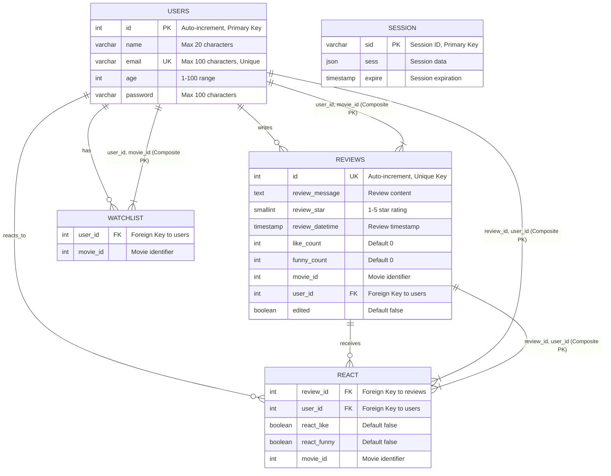

# Entity-Relationship Diagram for Movie Review System

## ER Diagram

## Quick Reference

**Tables**: USERS, REVIEWS, REACT, WATCHLIST, SESSION

**Key Relationships**:
- Users write Reviews (1:M)
- Users react to Reviews (1:M)
- Users maintain Watchlists (1:M)
- Reviews receive Reactions (1:M)

For detailed entity descriptions, constraints, and design notes, see [Database Schema Documentation](./Database_Schema.md)
