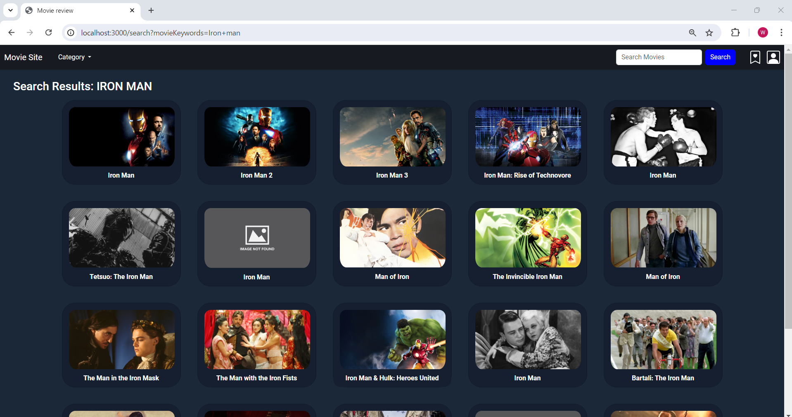

# A Movie Review Site

## Description

This is a movie review site built with node.js and express. All the data for movies are getting from the [TMDB API](https://developer.themoviedb.org/docs/getting-started).

In this application you can:
- You can Sign-Up/Sign-in/Sign-out as a user
- edit your user name or change your password
- Add your favourite movies in watchlist
- search movies with keyword or category
- make,edit or delete your review and rate movies with star
- react to reviews make by other user


## Tech Stack && Installation
- [Node.js](https://nodejs.org/en)
- [Express](https://expressjs.com/)
- [TMDB API](https://developer.themoviedb.org/docs/getting-started)
- [PostgreSQL](https://www.postgresql.org/download/)
- [axios](https://github.com/axios/axios/)
   

## Usage
To clone this application enter the following command:
```
git clone https://github.com/JORUNOJOSTAR/MovieReview.git
```

## .env file

Use .env.example after renaming it to .env. Also, you need to get your own necessary authentication key and passwords accordingly.

## After cloning

Enter the following command in the terminal to run the app:

```
npm i
```

Finally,

```
nodemon index.js
```

## Result

You can check the site on your localhost with the port you set on .env file

`localhost:{port-number}`





